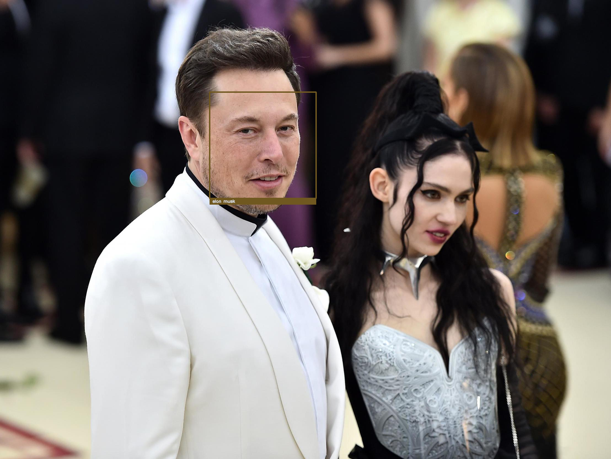

# Face-Recognition-in-python
This repo contains the code to an application writen to detect and identify faces in images and video feed. 
This is done with the help of the face recognition and cv2 module

### How to use: 
- Clone the repo\
```git clone https://github.com/Ajay051198/Face-Recognition-in-python.git```
- Add the faces to train on to the known_faces folder and place faces of a individual person in a folder named with their name
- Run train.py, this trains the model and encodes the facial features of each person in a numpy array along with the labelling maping the images. \
```python train.py```


### You are now ready to detect faces ! 

- To detect faces in images run the following command. ```python recogonize.py --image name_of_file.jpg```
- To detect faces in video run the following command. ```python recogonize.py --video name_of_file.mp4```
- To detect faces in video stream run the following command. ```python recogonize.py```

---

Results: 




---

### Conclusion: 

The two modules are very powerful tools and after being trained on a large enough dataset, this model could be very accurate. 

Given one has a small dataset, one should look at other facial recognition options

